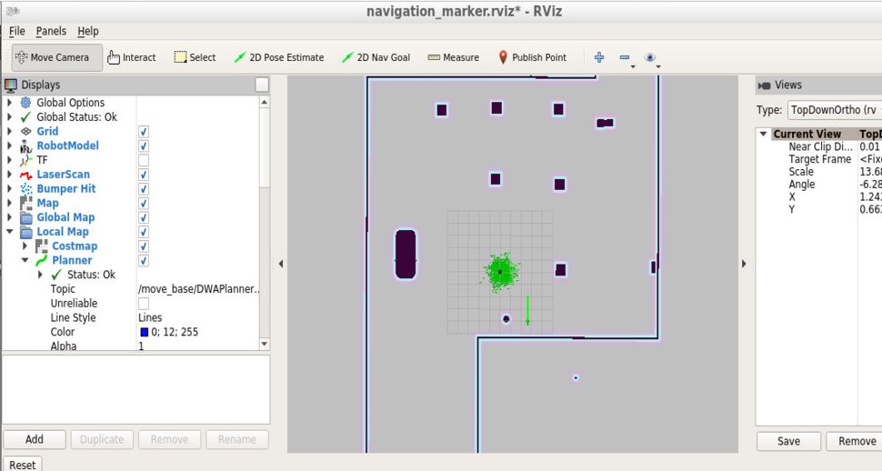

# Home Service Robot
The repo consists of various shell scripts that launch multiple nodes such that a mobile robot can simulate a pick and place action in rviz. All the shell scripts are in the scripts folder.

This is an excercise as a part of the Udacity Robotics Software Engineer Nano degree.

# Usage 
* Install the required dependencies as shown below :

```bash
$ sudo apt-get install ros-kinetic-navigation
$ sudo apt-get install ros-kinetic-map-server
$ sudo apt-get install ros-kinetic-move-base
$ sudo apt-get install ros-kinetic-amcl
```

* Clone the repo. Note that the repo uses git submodules to maintain the third party repos
```
$ curl -s https://packagecloud.io/install/repositories/github/git-lfs/script.deb.sh | sudo bash
$ sudo apt install git-lfs
```
The above is for debian systems if you need to install in any other follow this [link](https://git-lfs.github.com/)

* Once installed get into the localization directory and follow this:
```
cd localization
git lfs install 
git lfs pull
```

* After building the repo, to launch the pick and place simulation,run as shown below:

```bash
cd scripts
./home_service.sh
```

# Demo 

* Kindly remember to set the intial pose of the robot using the 2D pose estimate tool in rviz, as shown below:


* Note that if the above step is not done the robot may not behave as desired. One more important note is that the setup takes a long time so let the system load up, not to worry :).

